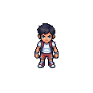
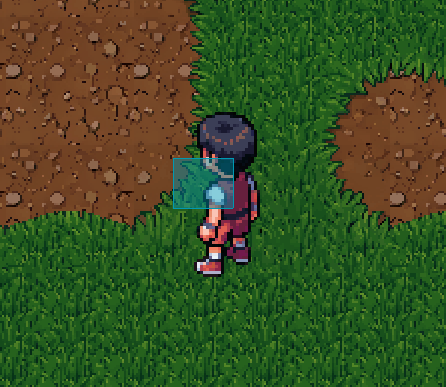
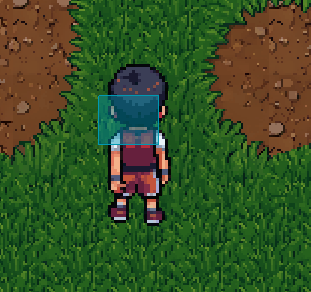
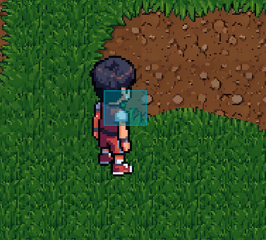
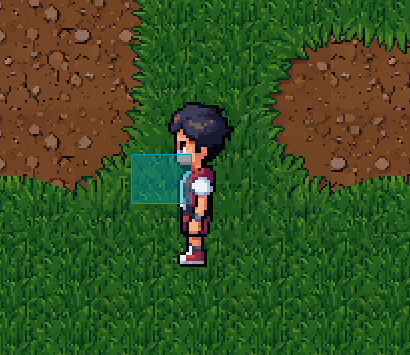
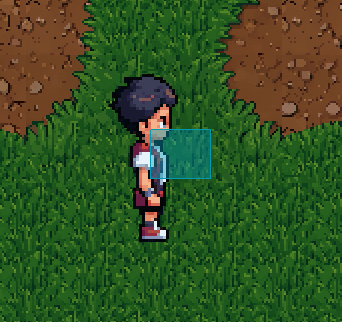
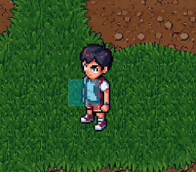
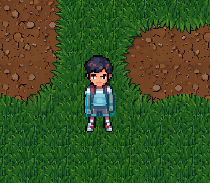
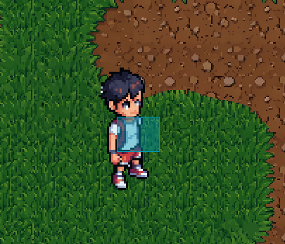
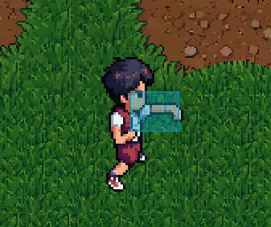

# Characters

# 8 direction movement
<table>
  <tr>
    <td align="center"> Up-left</td>
    <td align="center"> Up</td>
    <td align="center"> Up-right</td>
  </tr>
  <tr>
    <td align="center"> Left</td>
    <td align="center"></td>
    <td align="center"> Right</td>
  </tr>
  <tr>
    <td align="center"> Down-left</td>
    <td align="center"> Down</td>
    <td align="center"> Down-right</td>
  </tr>
</table>

# Atack and Hitbox

<b>The light blue square shows the hitbox — enemies inside it will take damage when the attack is triggered.</b>

